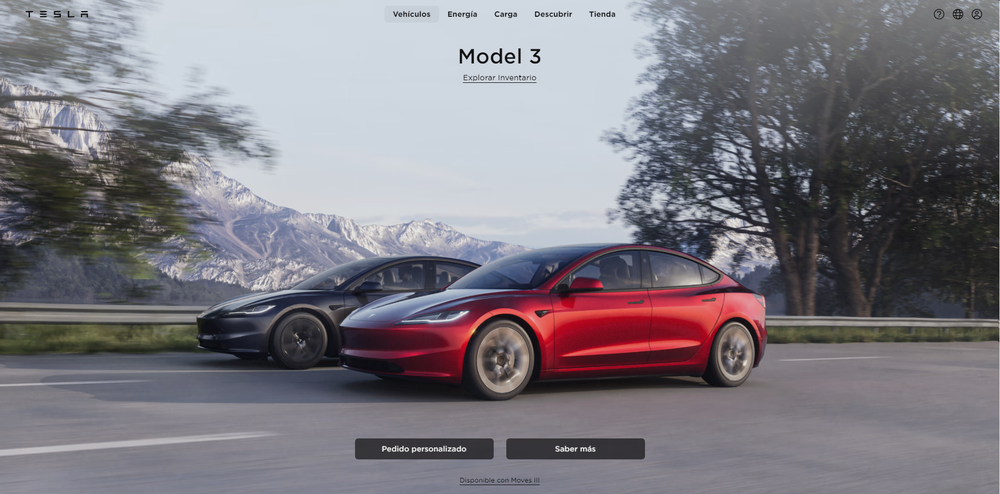

# Tesla Landing Page Clone

Este proyecto es una réplica de la página de inicio del sitio web de Tesla. Es una página estática diseñada para mostrar habilidades de desarrollo web front-end utilizando TailwindCSS, JavaScript y Astro.

## Tecnologías Utilizadas

- HTML
- CSS
- TailwindCSS
- JavaScript
- Astro

## Créditos

Este proyecto fue inspirado por @midudev.

